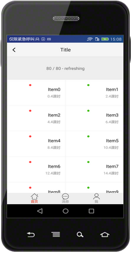
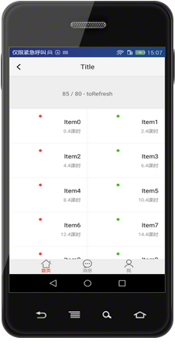

# react-native-ptrframe

This is a `Pull to Refresh` componnet in React Native for both Android and iOS.
This is a javascript only implementation.

## Demo





## Usage

1. Run `npm install react-native-ptrframe --save`
2. Code like this:

```
import PtrLayout from 'react-native-ptrframe';

      <PtrLayout ref="ptrLayout"
                 height={H}
                 width={W}
                 refreshOffset={80}
                 onRefresh={()=>{setTimeout(()=>{this.refs.ptrLayout.complete()}, 3000)}}
                 onTouchBegin={()=>{
                   this.refs.listView.setNativeProps({scrollEnabled: false});
                 }}
                 onTouchEnd={()=>{
                   this.refs.listView.setNativeProps({scrollEnabled: true});
                 }}
                 renderPtrHeader={(offset, threshold, state)=>(
                   <View style={{flex: 1, flexDirection: 'row', justifyContent: 'center', alignItems: 'center'}}>
                    <Text>{Math.floor(offset)} / {threshold} - {state}</Text>
                   </View>
                 )} >
        <ListView
          ref="listView"
          scrollEnabled={this.state.scrollEnabled}
          dataSource={this.state.teacherList}
          renderRow={this._renderRow.bind(this)}
          contentContainerStyle={styles.list}
          onEndReached={this._loadMore.bind(this)}
          scrollEventThrottle={16}
          onScroll={(event)=>{
            this.refs.ptrLayout.enablePtr(event.nativeEvent.contentOffset.y <= 0);
          }}/>
      </PtrLayout>
```

## Properties

* **`height`**: this is total height for entire layout, add this because if inner ListView has a contentContainerStyle {flexDirection: row}, the scroll view won't scroll anymore.
* **`width`**: this is total width of the refresh header, add this because the refresh header is {position: 'absolute'}.
* **`refreshOffset`**: threshold value, cancel/refresh when release touch.
* **`onRefresh`**: function when do refresh.
* **`renderPtrHeader`**: render refresh header view.
* **`onTouchBegin`**: invoke when pull begin, used to disable content touching ability, since some content may get touch control which make pull gesture terminated.
* **`onTouchEnd`**: invoke when pull end, used to enable content touching ability.
* **`completeTime`**: refresh header shrink time, default is 200.

## Licensed

MIT License
